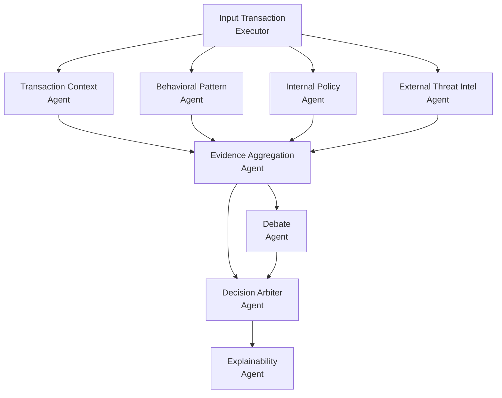

# AI Engineer Challenge — Sistema Multiagente para Evaluación de Riesgo Transaccional

## Qué hace este proyecto

Este proyecto implementa un sistema multiagente para analizar transacciones financieras y devolver una decisión de riesgo con trazabilidad completa. La solución combina análisis en paralelo, consolidación de evidencia, decisión final y explicación para cliente y auditoría.

La arquitectura está pensada para correr con frontend en Azure App Service y backend de agentes en Azure AI Foundry, usando Azure OpenAI, Azure AI Search y Azure Cosmos DB.

## 1) Diseño de arquitectura multiagente y orquestación

El flujo de agentes está definido con roles claros y coordinación con Microsoft Agent Framework (`WorkflowBuilder`), aplicando patrones de `RAG`, `HITL` y concurrencia.

Más detalle de roles, tool calls e interacción:
- [docs/agent-architecture.md](docs/agent-architecture.md)

## 2) Implementación del flujo multiagente

Flujo implementado:

1. Ingreso y enriquecimiento de transacción.
2. Análisis paralelo por contexto, comportamiento, política interna e inteligencia externa.
3. Agregación de evidencia.
4. Debate balanceado (pro fraude vs pro cliente).
5. Decisión final.
6. Explicación final con soporte para revisión humana.

Patrones usados:
- Concurrencia por `fan-out`/`fan-in`.
- Agregación de evidencia por agente dedicado.
- Convergencia dual para decisión (`evidence_aggregation` + `debate`).

Más detalle técnico de la orquestación:
- [docs/agent-architecture.md](docs/agent-architecture.md)

## 3) Integración de fuentes internas (RAG) y externas (web search)

Fuentes internas:
- Políticas de fraude indexadas en Azure AI Search (`fraud_policies_index`) con embeddings.
- Historial de comportamiento y transacciones en Cosmos DB.

Fuentes externas:
- Búsqueda web gobernada para señales de amenaza, utilizada por `ExternalThreatIntelAgent`.

La solución combina evidencia interna con señales externas para mejorar la calidad de la decisión.

Más detalle funcional:
- [docs/agent-architecture.md](docs/agent-architecture.md)
- [docs/project-set-up.md](docs/project-set-up.md)

## 4) Trazabilidad y auditabilidad

La salida de decisión incluye:
- decisión final (`ALLOW`, `CHALLENGE`, `BLOCK`, `ESCALATE_TO_HUMAN`)
- nivel de confianza
- señales detectadas
- citas internas (`policy_id`, `chunk_id`, `version`)
- citas externas (URL y resumen)
- explicación para cliente
- explicación para auditoría

Persistencia de estado:
- Se usa `Checkpoint Store` del Agent Framework (`FileCheckpointStorage`) para guardar el estado de ejecución del workflow.
- Este registro permite conservar la trazabilidad de ejecución de cada agente durante el proceso de decisión.

Human in the Loop:
- Ante `ESCALATE_TO_HUMAN`, se exige aprobación humana explícita mediante herramienta con `approval_mode="always_require"`.

Más detalle de estructura y trazabilidad de decisión:
- [docs/agent-architecture.md](docs/agent-architecture.md)

## 5) Despliegue en nube y prácticas DevOps

Arquitectura de solución:
- Frontend: Azure App Service.
- Backend multiagente: Azure AI Foundry.
- Servicios gestionados: Azure OpenAI, Azure AI Search, Azure Cosmos DB.

Infraestructura como código:
- Terraform para aprovisionamiento de servicios base.

Buenas prácticas aplicadas:
- Uso de variables de entorno (`.env`) para configuración local.
- Managed Identity y federación para automatización de repositorio.

Más detalle de arquitectura e inicialización:
- [docs/solution-architecture.md](docs/solution-architecture.md)
- [docs/initial-set-up.md](docs/initial-set-up.md)
- [docs/project-set-up.md](docs/project-set-up.md)

## 6) Ejecución del proyecto

Guía paso a paso:
- [docs/project-set-up.md](docs/project-set-up.md)

Orden recomendado:
1. Aprovisionar infraestructura (`infra/`).
2. Cargar conocimiento en AI Search.
3. Subir datasets de `src/resources` a Cosmos DB por contenedor.
4. Ejecutar backend Python (`src/main.py`).
5. Ejecutar frontend (`src/frontend`).

## 7) Casos de prueba y evidencia de funcionamiento

Se incluyen casos de transacción para cubrir los cuatro resultados de decisión:
- `APPROVE`
- `CHALLENGE`
- `ESCALATE_TO_HUMAN`
- `BLOCK`

Cada caso incluye JSON de entrada y una explicación breve de por qué debería caer en ese resultado.

Detalle de casos:
- [docs/transaction-cases.md](docs/transaction-cases.md)

## 8) Mejoras siguientes

Mejoras recomendadas:
- Definir métricas operativas por agente (latencia, precisión, tasa de escalamiento).
- Incorporar tableros de observabilidad orientados a auditoría.
- Versionar políticas de fraude con control de cambios y evaluación offline.
- Extender rutas HITL para distintos niveles de severidad.

## Documentación complementaria

- [docs/solution-architecture.md](docs/solution-architecture.md)
- [docs/agent-architecture.md](docs/agent-architecture.md)
- [docs/project-set-up.md](docs/project-set-up.md)
- [docs/transaction-cases.md](docs/transaction-cases.md)
- [docs/initial-set-up.md](docs/initial-set-up.md)
