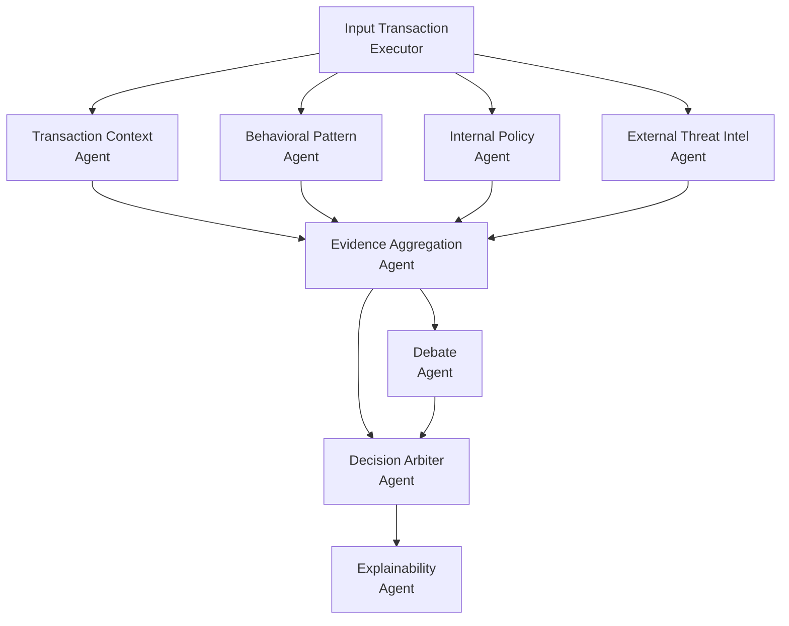

# Arquitectura de agentes de IA

## Enfoque

La arquitectura se orienta a evaluación de riesgo transaccional mediante un flujo multiagente. La ejecución combina análisis paralelo, consolidación de evidencia, contraste de argumentos, decisión final y explicación trazable.

## Workflow de ejecución

## Orquestación con Microsoft Agent Framework

La orquestación se implementa con `WorkflowBuilder` de Microsoft Agent Framework, usando un grafo dirigido de ejecutores y agentes especializados.

### Patrones de concurrencia aplicados

- **Fan-out (paralelismo)**: desde `InputTransactionExecutor` se abren ramas concurrentes hacia:
    - `TransactionContextAgent`
    - `BehavioralPatternAgent`
    - `InternalPolicyAgent`
    - `ExternalThreatIntelAgent`
- **Fan-in (convergencia)**: los resultados de las cuatro ramas se consolidan en `EvidenceAggregationAgent`.
- **Encadenamiento secuencial**: después de consolidar, el flujo continúa hacia `DebateAgent`.
- **Fan-in compuesto**: `DecisionArbiterAgent` recibe dos entradas en paralelo lógico:
    - salida consolidada de `EvidenceAggregationAgent`
    - salida argumental de `DebateAgent`
- **Etapa final**: `ExplainabilityAgent` transforma la decisión arbitral en salida explicable y trazable.

### Configuración del workflow (implementación actual)

La topología de orquestación se define con estas operaciones:

1. `add_fan_out_edges(start_executor, concurrent_agents)`
2. `add_fan_in_edges(concurrent_agents, evidence_aggregation)`
3. `add_edge(evidence_aggregation, debate_agent)`
4. `add_fan_in_edges([debate_agent, evidence_aggregation], decision_arbiter)`
5. `add_edge(decision_arbiter, explainability_agent)`
6. `build()`

### Human in the Loop (HITL)

La arquitectura incorpora Human in the Loop en la etapa final, con control explícito por decisión:

- Si el árbitro emite `ESCALATE_TO_HUMAN`, `ExplainabilityAgent` debe invocar exactamente una vez la herramienta `review_transaction(...)`.
- La herramienta `review_transaction` está declarada con `approval_mode="always_require"`, lo que fuerza confirmación humana antes de completar la acción.
- Si la decisión es `ALLOW`, `CHALLENGE` o `BLOCK`, no se invocan herramientas humanas y se devuelve explicación final directa.

Además, existen componentes dedicados (`HumanInterventionExecutor` y `HumanInterventionInputAdapter`) para desacoplar la intervención humana en un flujo extendido cuando se requiera una ruta de revisión independiente.

## Propósito de cada agente

- **InputTransactionExecutor**: recibe la transacción y activa el pipeline de evaluación.
- **TransactionContextAgent**: analiza el contexto operativo de la transacción (canal, origen, temporalidad y señales de entorno inmediato).
- **BehavioralPatternAgent**: identifica desviaciones frente al comportamiento histórico esperado del cliente o cuenta.
- **InternalPolicyAgent**: valida consistencia con políticas internas, reglas de negocio y criterios de cumplimiento.
- **ExternalThreatIntelAgent**: incorpora señales de inteligencia externa (indicadores de fraude, riesgo emergente y patrones reportados).
- **EvidenceAggregationAgent**: unifica resultados parciales en una evidencia común, estructurada y comparable.
- **DebateAgent**: somete la evidencia a contraste argumental para reducir sesgo y reforzar robustez analítica.
- **DecisionArbiterAgent**: emite la decisión final ponderando evidencia consolidada y resultado del debate.
- **ExplainabilityAgent**: genera una explicación clara, verificable y útil para auditoría y revisión humana.

## Detalle técnico por agente (tool calls, funciones externas e I/O)

### 1) InputTransactionExecutor

- **Tool calls**
    - `search_transaction_by_id(transaction_id)`
- **Funciones externas e integraciones**
    - `get_cosmos_database_client()` para abrir conexión a Cosmos DB.
    - `database.get_container_client("transactions")` para acceder al contenedor de transacciones.
    - `container.query_items(...)` con filtro por `transaction_id`.
    - `close_cosmos_client(client)` para cierre de conexión.
- **Entrada esperada**
    - Mensaje con identificador de transacción (ejemplo: `T-1001`).
- **Salida**
    - JSON estricto con forma `{"transaction": "..."}`.
- **Notas de implementación**
    - El resultado de Cosmos se sanea para remover campos del sistema (`_...`).

### 2) TransactionContextAgent

- **Tool calls**
    - No define herramientas.
- **Funciones externas e integraciones**
    - Solo inferencia LLM vía `AzureOpenAIChatClient.as_agent(...)`.
- **Entrada esperada**
    - Contexto completo de transacción.
- **Salida**
    - Análisis textual breve de riesgo contextual.

### 3) BehavioralPatternAgent

- **Tool calls**
    - `search_customer_behavior(customer_id)`
- **Funciones externas e integraciones**
    - `get_cosmos_database_client()`.
    - `database.get_container_client("customer_behaviors")`.
    - `container.query_items(...)` usando `partition_key=customer_id`.
    - `close_cosmos_client(client)`.
- **Entrada esperada**
    - Transacción desde la que se extrae `customer_id`.
- **Salida**
    - Evaluación de anomalías respecto del historial del cliente.

### 4) InternalPolicyAgent

- **Tool calls**
    - `search_internal_fraud_policies(transaction_text)`
    - `search_customer_behavior(customer_id)`
- **Funciones externas e integraciones**
    - Azure OpenAI Embeddings (`AzureOpenAI(...).embeddings.create(...)`) para vectorizar la transacción.
    - Azure AI Search (`SearchClient.search(...)`) con `VectorizedQuery` sobre índice `fraud_policies_index`.
    - Cosmos DB para historial en `customer_behaviors`.
    - Soporte de autenticación por API key o `DefaultAzureCredential`.
- **Entrada esperada**
    - Texto completo de transacción.
- **Salida**
    - Evaluación contra políticas internas y propuesta de código de policy aplicable (si corresponde), incluyendo citas (`policy_id`, `chunk_id`, `version`).

### 5) ExternalThreatIntelAgent

- **Tool calls**
    - Herramienta de búsqueda web obtenida por `client.get_web_search_tool(...)`.
- **Funciones externas e integraciones**
    - `OpenAIResponsesClient` (Responses API).
    - Búsqueda web con configuración de ubicación (`Lima, PE`) y contexto de búsqueda bajo.
- **Entrada esperada**
    - Contexto de transacción para consulta de inteligencia externa.
- **Salida**
    - Señales de riesgo con referencias URL cuando están disponibles.

### 6) EvidenceAggregationAgent

- **Tool calls**
    - No define herramientas.
- **Funciones externas e integraciones**
    - Handler asíncrono `aggregate(results, ctx)`.
    - Procesa objetos `AgentExecutorResponse` y toma el último mensaje `assistant` de cada rama.
    - Genera resumen consolidado vía `self.agent.run(combined)`.
    - Publica por `ctx.send_message(...)` y `ctx.yield_output(...)`.
- **Entrada esperada**
    - Resultados finales de agentes paralelos.
- **Salida**
    - Síntesis estructurada por agente.

### 7) DebateAgent

- **Tool calls**
    - No define herramientas.
- **Funciones externas e integraciones**
    - Inferencia LLM con formato guiado (PRO FRAUDE vs PRO CLIENTE).
- **Entrada esperada**
    - Evidencia consolidada de la transacción.
- **Salida**
    - Debate balanceado con conclusión comparativa sin decisión final.

### 8) DecisionArbiterAgent

- **Tool calls**
    - No define herramientas.
- **Funciones externas e integraciones**
    - Handler asíncrono `aggregate(results, ctx)` para combinar entradas de `debate` y `evidence_aggregation`.
    - Parseo de JSON (`json.loads`) de la respuesta del modelo.
    - Validación de formato objetivo mediante `DecisionArbiterOutput`.
    - Emisión de resultado por `ctx.send_message(...)` y `ctx.yield_output(...)`.
- **Entrada esperada**
    - Evidencia consolidada y argumentos del debate.
- **Salida**
    - JSON de decisión final con estructura:
        - `decision`
        - `confidence`
        - `signals`
        - `citations_internal`
        - `citations_external`
        - `explanation_customer`
        - `explanation_audit`

### 9) ExplainabilityAgent

- **Tool calls**
    - `review_transaction(transaction_id)` con `approval_mode="always_require"`.
- **Funciones externas e integraciones**
    - Logging operativo cuando se invoca revisión humana.
    - Lógica guiada por instrucción:
        - Si `decision == "ESCALATE_TO_HUMAN"`, invoca exactamente una vez `review_transaction`.
        - Para otros casos, no usa herramientas.
- **Entrada esperada**
    - JSON de decisión emitido por `DecisionArbiterAgent`.
- **Salida**
    - JSON final con explicación breve y trazable, preservando la decisión.

## Dependencias transversales relevantes

- **Framework de orquestación**
    - `agent_framework` (`AgentExecutor`, `Executor`, `WorkflowContext`, `handler`, `tool`).
- **Modelos y clientes**
    - `AzureOpenAIChatClient` para agentes de análisis interno.
    - `OpenAIResponsesClient` para capacidades de búsqueda web.
- **Datos y recuperación**
    - Cosmos DB (`transactions`, `customer_behaviors`).
    - Azure AI Search (índice de políticas internas).
- **Autenticación**
    - API keys y/o `DefaultAzureCredential` según servicio.

## Secuencia lógica

1. Entrada de transacción.
2. Análisis paralelo por contexto, comportamiento, política interna e inteligencia externa.
3. Consolidación de evidencia.
4. Debate sobre la evidencia consolidada.
5. Arbitraje de decisión usando evidencia y debate.
6. Generación de explicación final.
