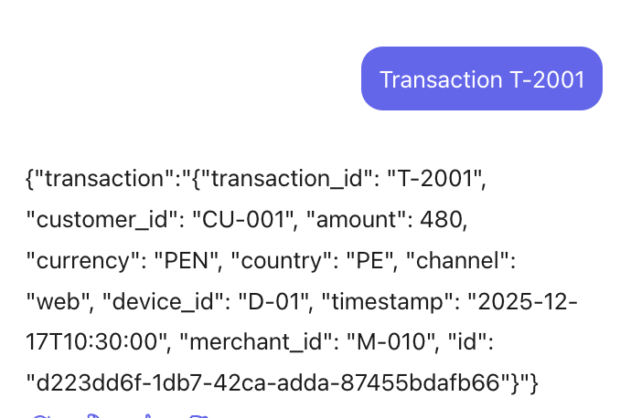
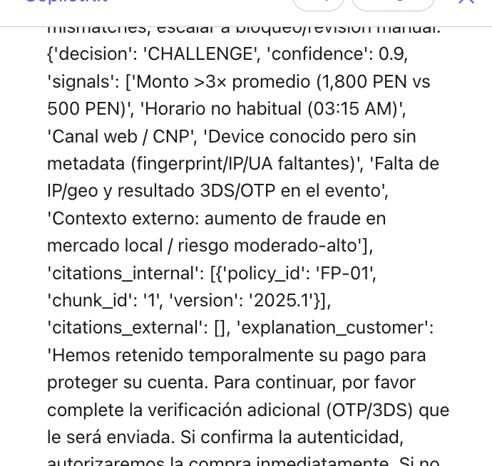
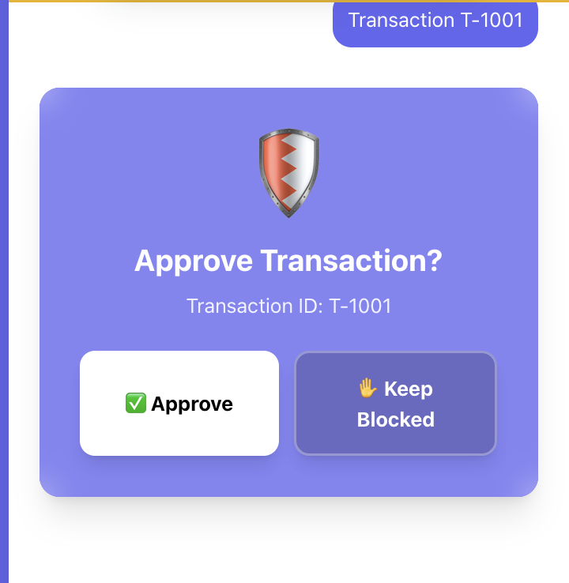
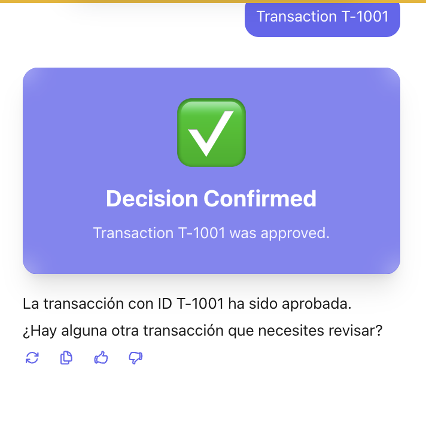

# Evaluation Evidence

## Objetivo

Este documento sirve como guía rápida para la demo y como plantilla de evidencia.
Para cada caso se indica:

- Transacción a ejecutar
- Resultado esperado
- Evidencia a adjuntar

Referencia de detalle técnico:

- [agent-architecture.md](agent-architecture.md)
- [transaction-cases.md](transaction-cases.md)
- [project-set-up.md](project-set-up.md)

---

## Caso 1 — APPROVE

- **Transacción a ejecutar**: `T-2001`
- **Resultado esperado**: `APPROVE`
- **Razón esperada**: monto cercano al promedio, horario en rango, país/dispositivo habituales.

### Evidencia

```json
{
	"case": "APPROVE",
	"transaction_id": "T-2001",
	"expected_decision": "APPROVE",
	"ui_evidence": {
		"screenshots": ["[PEGAR_RUTA_O_NOMBRE_IMAGEN]"]
	},
	"decision_output": {
		"decision": "[PEGAR]",
		"confidence": "[PEGAR]",
		"signals": ["[PEGAR]"]
	},
	"citations": {
		"internal": ["[PEGAR]"],
		"external": ["[PEGAR]"]
	},
	"checkpoint_trace": {
		"files": ["[PEGAR_ARCHIVO_CHECKPOINT]"],
		"notes": "[PEGAR_EXTRACTO]"
	}
}
```

---

## Caso 2 — CHALLENGE

- **Transacción a ejecutar**: `T-1001`
- **Resultado esperado**: `CHALLENGE`
- **Razón esperada**: monto > 3x promedio + horario fuera de rango.

### Evidencia



```json
{
  "decision": "CHALLENGE",
  "confidence": 0.9,
  "signals": [
    "Monto >3× promedio (1,800 PEN vs 500 PEN)",
    "Horario no habitual (03:15 AM)",
    "Canal web / CNP",
    "Device conocido pero sin metadata (fingerprint/IP/UA faltantes)",
    "Falta de IP/geo y resultado 3DS/OTP en el evento",
    "Contexto externo: aumento de fraude en mercado local / riesgo moderado‑alto"
  ],
  "citations_internal": [
    {
      "policy_id": "FP-01",
      "chunk_id": "1",
      "version": "2025.1"
    }
  ],
  "citations_external": [],
  "explanation_customer": "Hemos retenido temporalmente su pago para proteger su cuenta. Para continuar, por favor complete la verificación adicional (OTP/3DS) que le será enviada. Si confirma la autenticidad, autorizaremos la compra inmediatamente. Si no puede completar la verificación, contactaremos al soporte para ayudarle.",
  "explanation_audit": "La política interna FP-01 (chunk_id 1, v2025.1) prescribe CHALLENGE cuando amount > 3× promedio habitual y la transacción ocurre fuera de la ventana horaria usual. Cálculo: 1,800 PEN > 3 × 500 PEN = 1,500 PEN y timestamp 2025-12-17T03:15 está fuera de la ventana 08:00–20:00, por lo que FP-01 aplica. Agentes behavioral_pattern, transaction_context e external_threat_intel concordaron en riesgo moderado‑alto dada la combinación monto elevado + horario nocturno + canal web (CNP). Factores atenuantes: device_id D-01 y país PE coinciden con historial del cliente, pero falta metadata crítica (fingerprint, IP/geo, UA) y no hay resultado 3DS/OTP en el evento. Acción prescrita: ejecutar challenge 3DS/OTP y recolectar IP, fingerprint y BIN lookup; si el challenge se supera y los checks device/IP/BIN son consistentes, AUTORIZAR; si el challenge falla o se detectan mismatches/indicadores adicionales, BLOQUEAR y escalar a revisión humana/investigación forense. Referenciado: internal policy FP-01 (chunk 1, v2025.1)."
}
```
---

## Caso 3 — ESCALATE_TO_HUMAN

- **Transacción a ejecutar**: `T-2003`
- **Resultado esperado**: `ESCALATE_TO_HUMAN`
- **Razón esperada**: transacción internacional + dispositivo nuevo.

### Evidencia (placeholder)

```json
{
	"case": "ESCALATE_TO_HUMAN",
	"transaction_id": "T-2003",
	"expected_decision": "ESCALATE_TO_HUMAN",
	"ui_evidence": {
		"screenshots": ["[PEGAR_RUTA_O_NOMBRE_IMAGEN]"]
	},
	"decision_output": {
		"decision": "[PEGAR]",
		"confidence": "[PEGAR]",
		"signals": ["[PEGAR]"]
	},
	"hitl_evidence": {
		"tool_call": "[PEGAR]",
		"human_approval": "[PEGAR]",
		"final_status": "[PEGAR]"
	},
	"checkpoint_trace": {
		"files": ["[PEGAR_ARCHIVO_CHECKPOINT]"],
		"notes": "[PEGAR_EXTRACTO]"
	}
}
```

---

## Caso 4 — BLOCK

- **Transacción a ejecutar**: `T-2004`
- **Resultado esperado**: `BLOCK`
- **Razón esperada**: monto alto + internacional (regla de mayor severidad).

### Evidencia (placeholder)

```json
{
	"case": "BLOCK",
	"transaction_id": "T-2004",
	"expected_decision": "BLOCK",
	"ui_evidence": {
		"screenshots": ["[PEGAR_RUTA_O_NOMBRE_IMAGEN]"]
	},
	"decision_output": {
		"decision": "[PEGAR]",
		"confidence": "[PEGAR]",
		"signals": ["[PEGAR]"]
	},
	"citations": {
		"internal": ["[PEGAR]"],
		"external": ["[PEGAR]"]
	},
	"checkpoint_trace": {
		"files": ["[PEGAR_ARCHIVO_CHECKPOINT]"],
		"notes": "[PEGAR_EXTRACTO]"
	}
}
```

---

## Checklist final de entrega

- [ ] Evidencia de los 4 casos (`APPROVE`, `CHALLENGE`, `ESCALATE_TO_HUMAN`, `BLOCK`)
- [ ] Evidencia de trazabilidad por checkpoints
- [ ] Evidencia de citas internas y externas cuando aplique
- [ ] Evidencia de HITL en el caso de escalamiento
- [ ] Enlace o referencia cruzada a documentación técnica en `docs/`

---

## Caso adicional — Validación Human in the Loop (HITL)
- **Transacción a ejecutar**: `T-2003`
- **Resultado esperado**: `ESCALATE_TO_HUMAN` con intervención humana efectiva.
- **Validación esperada**:
	- Se dispara el flujo de revisión humana.
	- Se ejecuta la herramienta de revisión (`review_transaction`).
	- Se conserva evidencia de la aprobación y del cierre del flujo.

### Evidencia 

