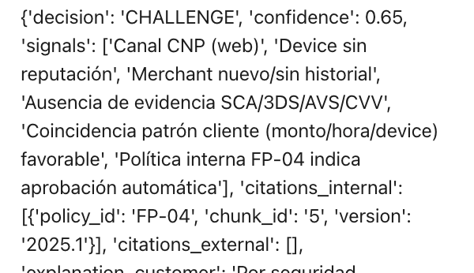
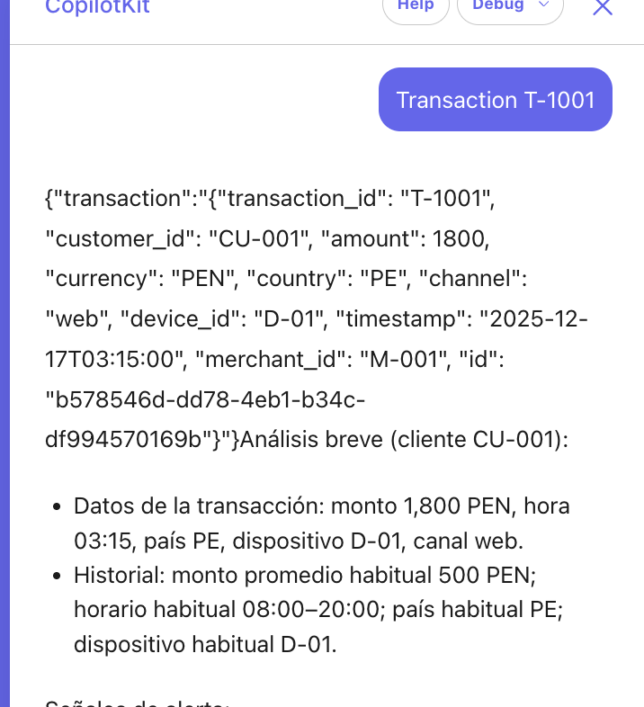
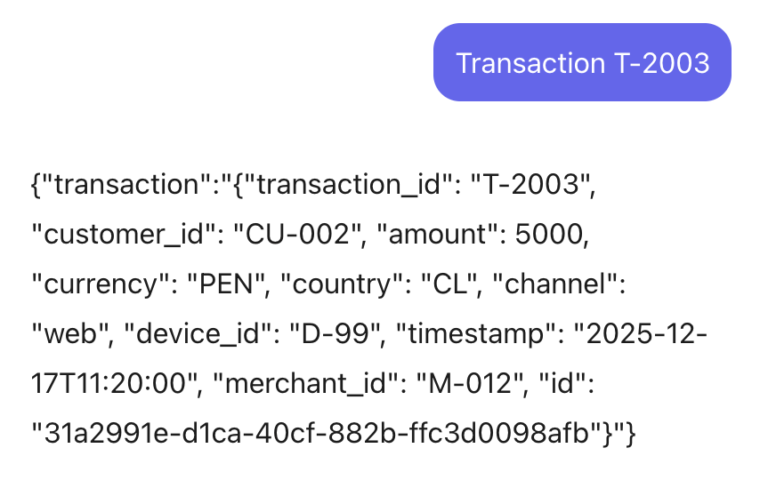
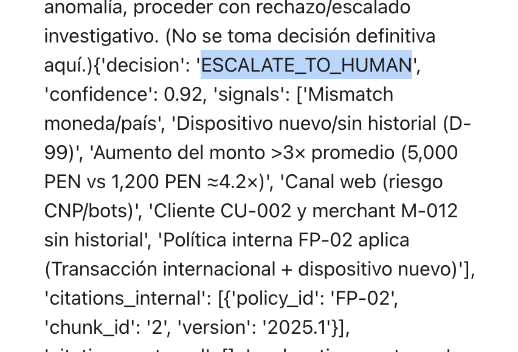
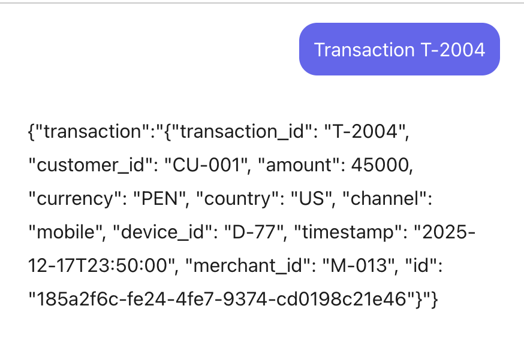
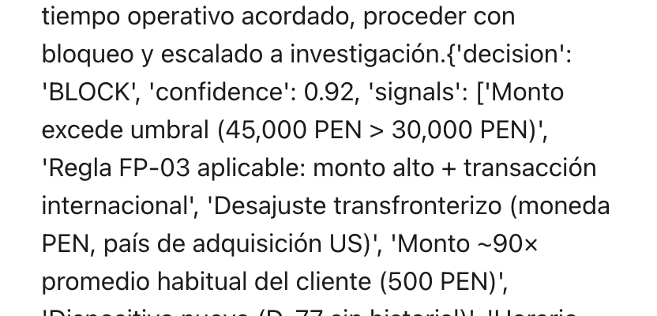

# Evaluation Evidence

## Objetivo

Este documento sirve como guía rápida para la demo y como plantilla de evidencia.
Para cada caso se indica:

- Transacción a ejecutar
- Resultado esperado
- Evidencia a adjuntar

Referencia de detalle técnico:

- [agent-architecture.md](agent-architecture.md)
- [transaction-cases.md](transaction-cases.md)
- [project-set-up.md](project-set-up.md)

---

## Caso 1 — APPROVE

- **Transacción a ejecutar**: `T-2001`
- **Resultado esperado**: `APPROVE`
- **Razón esperada**: monto cercano al promedio, horario en rango, país/dispositivo habituales.

### Evidencia


```json
{
  "decision": "CHALLENGE",
  "confidence": 0.65,
  "signals": [
    "Canal CNP (web)",
    "Device sin reputación",
    "Merchant nuevo/sin historial",
    "Ausencia de evidencia SCA/3DS/AVS/CVV",
    "Coincidencia patrón cliente (monto/hora/device) favorable",
    "Política interna FP-04 indica aprobación automática"
  ],
  "citations_internal": [
    {
      "policy_id": "FP-04",
      "chunk_id": "5",
      "version": "2025.1"
    }
  ],
  "citations_external": [],
  "explanation_customer": "Por seguridad necesitamos una verificación adicional antes de aprobar la compra. Se le solicitará autenticación fuerte (3DSv2/OTP) y verificaremos la ubicación/IP. Si completa la verificación la transacción se autorizará rápidamente.",
  "explanation_audit": "Balance de evidencia: el agente internal_policy (FP-04, chunk_id:5 v2025.1) y behavioral_pattern indican bajo riesgo y apoyo a aprobación automática por monto, horario y uso de device D-01 conocido del cliente. Sin embargo, transaction_context y external_threat_intel señalan riesgo medio‑alto por canal CNP, merchant M-010 y device D-01 sin reputación documentada y ausencia de evidencia de SCA. Dado que las comprobaciones técnicas recomendadas no aparecen completadas en los datos proporcionados, la decisión operativa es exigir challenge (SCA/3DSv2 u OTP) y ejecutar checks automáticos antes de autorizar: 1) solicitar/validar 3DSv2 o OTP; 2) ejecutar device‑fingerprinting/reputación para D-01; 3) verificar geolocalización/IP vs país PE y detectar VPN/proxy; 4) consultar historial/chargebacks de M-010 y revisar velocidad de transacciones de CU-001. Si los checks automáticos son todos favorables, se debe autorizar y registrar la aprobación; si hay discrepancias relevantes (IP mismatch, device/IP en listas negras, merchant con historial adverso) entonces escalar a revisión humana o bloquear según hallazgos. Registro de la decisión y todos los resultados de checks para auditoría y entrenamiento ML está requerido."
}
```

---

## Caso 2 — CHALLENGE

- **Transacción a ejecutar**: `T-1001`
- **Resultado esperado**: `CHALLENGE`
- **Razón esperada**: monto > 3x promedio + horario fuera de rango.

### Evidencia



```json
{
  "decision": "CHALLENGE",
  "confidence": 0.9,
  "signals": [
    "Monto >3× promedio (1,800 PEN vs 500 PEN)",
    "Horario no habitual (03:15 AM)",
    "Canal web / CNP",
    "Device conocido pero sin metadata (fingerprint/IP/UA faltantes)",
    "Falta de IP/geo y resultado 3DS/OTP en el evento",
    "Contexto externo: aumento de fraude en mercado local / riesgo moderado‑alto"
  ],
  "citations_internal": [
    {
      "policy_id": "FP-01",
      "chunk_id": "1",
      "version": "2025.1"
    }
  ],
  "citations_external": [],
  "explanation_customer": "Hemos retenido temporalmente su pago para proteger su cuenta. Para continuar, por favor complete la verificación adicional (OTP/3DS) que le será enviada. Si confirma la autenticidad, autorizaremos la compra inmediatamente. Si no puede completar la verificación, contactaremos al soporte para ayudarle.",
  "explanation_audit": "La política interna FP-01 (chunk_id 1, v2025.1) prescribe CHALLENGE cuando amount > 3× promedio habitual y la transacción ocurre fuera de la ventana horaria usual. Cálculo: 1,800 PEN > 3 × 500 PEN = 1,500 PEN y timestamp 2025-12-17T03:15 está fuera de la ventana 08:00–20:00, por lo que FP-01 aplica. Agentes behavioral_pattern, transaction_context e external_threat_intel concordaron en riesgo moderado‑alto dada la combinación monto elevado + horario nocturno + canal web (CNP). Factores atenuantes: device_id D-01 y país PE coinciden con historial del cliente, pero falta metadata crítica (fingerprint, IP/geo, UA) y no hay resultado 3DS/OTP en el evento. Acción prescrita: ejecutar challenge 3DS/OTP y recolectar IP, fingerprint y BIN lookup; si el challenge se supera y los checks device/IP/BIN son consistentes, AUTORIZAR; si el challenge falla o se detectan mismatches/indicadores adicionales, BLOQUEAR y escalar a revisión humana/investigación forense. Referenciado: internal policy FP-01 (chunk 1, v2025.1)."
}
```
---

## Caso 3 — ESCALATE_TO_HUMAN

- **Transacción a ejecutar**: `T-2003`
- **Resultado esperado**: `ESCALATE_TO_HUMAN`
- **Razón esperada**: transacción internacional + dispositivo nuevo.

### Evidencia 



```json
{
  "decision": "ESCALATE_TO_HUMAN",
  "confidence": 0.92,
  "signals": [
    "Mismatch moneda/país",
    "Dispositivo nuevo/sin historial (D-99)",
    "Aumento del monto >3× promedio (5,000 PEN vs 1,200 PEN ≈4.2×)",
    "Canal web (riesgo CNP/bots)",
    "Cliente CU-002 y merchant M-012 sin historial",
    "Política interna FP-02 aplica (Transacción internacional + dispositivo nuevo)"
  ],
  "citations_internal": [
    {
      "policy_id": "FP-02",
      "chunk_id": "2",
      "version": "2025.1"
    }
  ],
  "citations_external": [],
  "explanation_customer": "Hemos retenido temporalmente su pago por una revisión adicional porque se han detectado varias señales inusuales (día/país de compra distinto a su historial, nuevo dispositivo y un monto mayor al habitual). Para completar la verificación es posible que le solicitemos un código por SMS/OTP o confirmación por un canal seguro. Si confirma la transacción, la autorizaremos; si no podemos verificarla, la transacción quedará denegada para proteger su cuenta.",
  "explanation_audit": "Decisión: ESCALATE_TO_HUMAN según evidencia y política interna aplicable. Datos clave: transaction_id T-2003, monto 5,000 PEN, moneda PEN vs país de adquisición CL (mismatch), canal web, device_id D-99 no registrado en historial de CU-002, hora 2025-12-17T11:20 (dentro de ventana habitual). Behavioral metrics: promedio histórico 1,200 PEN → transacción ≈4.2× promedio (supera 3×). Policy evaluation: FP-02 (version 2025.1, chunk_id 2) establece 'Transacción internacional y dispositivo nuevo → ESCALATE_TO_HUMAN' y se cumple; FP-01 (requiere monto >3× promedio y horario fuera de rango) no aplica porque aunque el monto cumple, el horario está dentro de la ventana habitual. Riesgo global estimado por agentes: MEDIO, con múltiples señales coincidentes que justifican intervención humana. Recomendaciones operativas para la revisión humana: ejecutar geolocalización IP y BIN check, device fingerprinting y velocity, validar billing vs shipping, revisar reputación merchant M-012, solicitar OTP/2FA o contacto directo con cliente y preservar evidencia (device_id D-99, timestamp, merchant_id). Si la verificación confirma legitimidad, autorizar; si persisten inconsistencias o la autenticación falla, proceder a bloqueo y escalado investigativo. Referencia de política aplicada: FP-02 (chunk_id 2, version 2025.1)."
}
```

---

## Caso 4 — BLOCK

- **Transacción a ejecutar**: `T-2004`
- **Resultado esperado**: `BLOCK`
- **Razón esperada**: monto alto + internacional (regla de mayor severidad).

### Evidencia


```json
{
  "decision": "BLOCK",
  "confidence": 0.92,
  "signals": [
    "Monto excede umbral (45,000 PEN > 30,000 PEN)",
    "Regla FP-03 aplicable: monto alto + transacción internacional",
    "Desajuste transfronterizo (moneda PEN, país de adquisición US)",
    "Monto ~90× promedio habitual del cliente (500 PEN)",
    "Dispositivo nuevo (D-77 sin historial)",
    "Horario no habitual (23:50, fuera de ventana 08:00–20:00)",
    "Canal mobile — patrón asociado a account takeover/CNP"
  ],
  "citations_internal": [
    {
      "policy_id": "FP-03",
      "chunk_id": "4",
      "version": "2025.1"
    }
  ],
  "citations_external": [],
  "explanation_customer": "Por seguridad hemos bloqueado temporalmente esta transacción. El pago de 45,000 PEN realizado desde un país distinto al habitual, en un dispositivo y horario inusuales, activó una regla de riesgo alto. Para resolverlo, por favor espere el contacto de verificación por los canales registrados (o siga las instrucciones para autenticación adicional/OTP). Si usted autorizó la compra, confirme la operación durante la verificación; si no la autorizó, notifique inmediatamente al equipo de fraude del banco.",
  "explanation_audit": "Decisión: BLOCK. Razonamiento técnico: la transacción T-2004 presenta las siguientes condiciones verificadas en los datos observados: monto = 45,000 PEN; país de adquisición = US (internacional respecto al cliente cuya actividad histórica es en PE); dispositivo = D-77 (no registrado); hora = 2025-12-17T23:50 (fuera del rango habitual 08:00–20:00); promedio histórico cliente = 500 PEN (la operación es ~90×). La política FP-03 chunk 4 (version 2025.1) dispone explícitamente bloqueo cuando 'Transacción más de 30000 soles y e internacional → BLOCK'. Dado que ambas condiciones de esa regla se cumplen, se aplica la acción de BLOCK y prevalece sobre reglas de menor severidad. Otras reglas también coincidentes (FP-03 chunk 3 → ESCALATE_TO_HUMAN; FP-02 chunk 2 → ESCALATE_TO_HUMAN; FP-01 chunk 1 → CHALLENGE) refuerzan riesgo elevado pero han sido supersedidas por la regla más específica y severa (FP-03 chunk 4). Acciones operativas registradas: ejecutar bloqueo inmediato; registrar evidencia (device_id D-77, IP/geolocalización, merchant M-013, timestamps, historial CU-001); iniciar investigación manual/forense y screening AML/PEP/sanciones; intentar step-up auth y contacto telefónico al titular para validación rápida, con ventana operativa sugerida de 15–30 minutos para resolución antes de medidas adicionales. Confianza: alta (0.92) porque las condiciones de la regla de bloqueo están claramente satisfechas y múltiples agentes independientes reportan señales coincidentes de alto riesgo; no es 1.0 debido a ausencia de confirmación directa de compromiso y falta de contexto completo sobre merchant M-013, por lo que la investigación humana y la verificación al titular siguen siendo necesarias."
}
```

---

## Checklist final de entrega

- [ ] Evidencia de los 4 casos (`APPROVE`, `CHALLENGE`, `ESCALATE_TO_HUMAN`, `BLOCK`)
- [ ] Evidencia de trazabilidad por checkpoints
- [ ] Evidencia de citas internas y externas cuando aplique
- [ ] Evidencia de HITL en el caso de escalamiento
- [ ] Enlace o referencia cruzada a documentación técnica en `docs/`

---

## Caso adicional — Validación Human in the Loop (HITL)
- **Transacción a ejecutar**: `T-2003`
- **Resultado esperado**: `ESCALATE_TO_HUMAN` con intervención humana efectiva.
- **Validación esperada**:
	- Se dispara el flujo de revisión humana.
	- Se ejecuta la herramienta de revisión (`review_transaction`).
	- Se conserva evidencia de la aprobación y del cierre del flujo.

### Evidencia 

