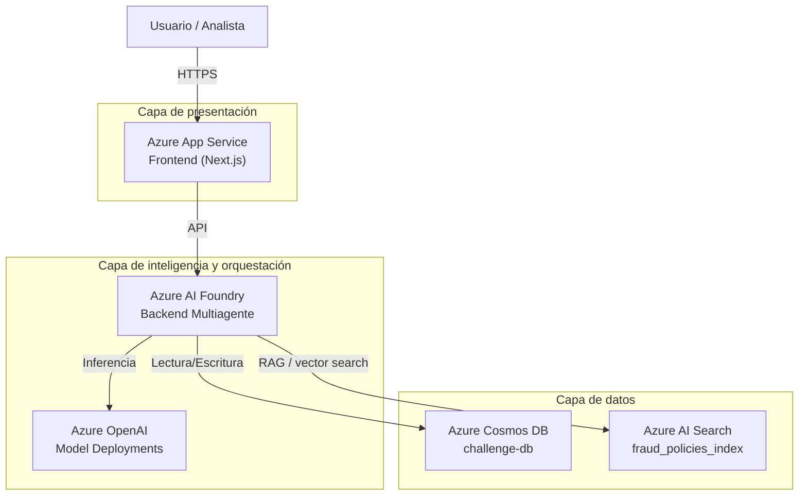

# Arquitectura de solución

## Objetivo

La solución se define con separación clara de capas:

- Frontend hospedado en **Azure App Service**.
- Backend de agentes hospedado en **Azure AI Foundry**.
- Servicios de soporte para datos, búsqueda y modelos de IA en Azure.

Esta arquitectura permite escalar la interfaz y la lógica de orquestación de manera independiente, manteniendo trazabilidad sobre decisiones de riesgo y fuentes de evidencia.

## Diagrama de infraestructura

## Flujo de solución

1. El usuario interactúa con el frontend en App Service.
2. El frontend invoca el backend desplegado en Foundry.
3. El backend ejecuta el flujo multiagente de análisis.
4. Los agentes consultan Cosmos DB, Azure AI Search y Azure OpenAI según el tipo de evidencia requerida.
5. El sistema retorna decisión y explicación al frontend.

## Componentes de la solución

- **Frontend en Azure App Service**
	- Aloja la interfaz de usuario y centraliza la interacción con el sistema.
	- Expone la experiencia de consulta y visualización de decisiones.

- **Backend en Azure AI Foundry**
	- Ejecuta la orquestación multiagente del flujo de análisis.
	- Coordina la evaluación de riesgo, el arbitraje de decisión y la explicación final.

- **Azure OpenAI**
	- Provee capacidades de inferencia y embeddings para tareas de razonamiento y recuperación semántica.

- **Azure Cosmos DB**
	- Administra la persistencia transaccional y de comportamiento histórico.

- **Azure AI Search**
	- Habilita la recuperación de políticas internas y evidencia documental con enfoque RAG.

## Principios de diseño

- **Separación de responsabilidades**
	- La capa de presentación, la orquestación de agentes y la capa de datos operan de manera desacoplada.

- **Escalabilidad por capa**
	- Frontend y backend se escalan de forma independiente según demanda funcional y operativa.

- **Trazabilidad de decisiones**
	- La solución conserva evidencia de análisis, fuentes utilizadas y explicación final para auditoría.

- **Seguridad y control de acceso**
	- La integración entre servicios se diseña con identidad administrada y control de permisos por mínimo privilegio.

## Resultado esperado

La arquitectura establece una plataforma de evaluación de riesgo transaccional robusta, explicable y preparada para crecimiento, con frontend en App Service y backend multiagente en Azure AI Foundry, respaldada por servicios administrados de datos y búsqueda en Azure.
