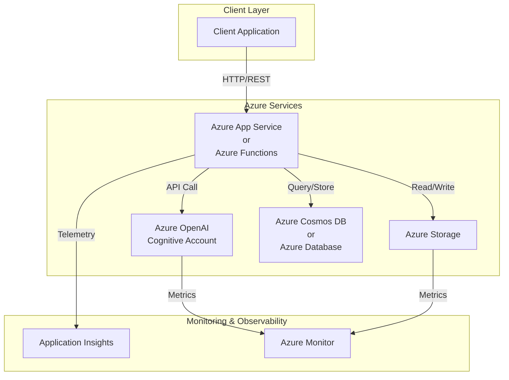
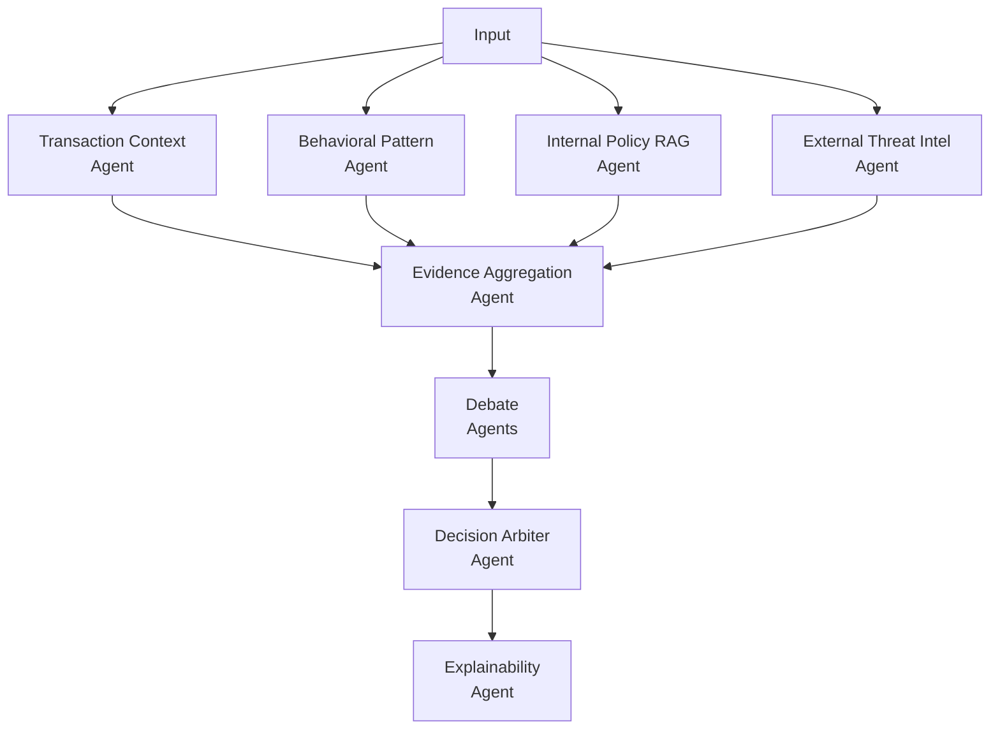

# Solution Architecture

## Overview

This document describes the architecture for the AI Engineer Challenge solution. The solution leverages Azure services to build a scalable AI-powered application.

## Solution Architecture Diagram

## Components

### Client Layer
- **Client Application**: Consumes the APIs provided by the application

### Azure Services
- **Azure OpenAI (Cognitive Account)**: Provides AI/ML capabilities using OpenAI models (GPT, Embedding, etc.)
- **Azure App Service/Functions**: Hosts the application logic and APIs
- **Azure Storage**: Handles data persistence (files, blobs, documents)
- **Azure Cosmos DB / Azure Database**: Stores structured application data

### Monitoring & Observability
- **Application Insights**: Collects application telemetry and diagnostics
- **Azure Monitor**: Provides monitoring and alerting for Azure resources

## Data Flow

1. Client requests are received by the application
2. Application processes requests using Azure OpenAI for AI capabilities
3. Data is persisted in Storage and CosmosDB as needed
4. Telemetry is sent to Application Insights
5. Responses are returned to the client

## AI Architecture Diagram

## Infrastructure as Code

The infrastructure is defined using Terraform with the following key resources:
- Azure Resource Group: `rg-ai-engineer-challenge`
- Azure OpenAI Cognitive Account
- Additional resources (to be defined)

## Deployment

Terraform configurations are stored in the `/infra` directory:
- `main.tf`: Main resource definitions
- `providers.tf`: Provider configuration and backend setup
- Backend: Azure Storage (state file storage)

## Next Steps

- [ ] Define additional Azure resources as needed
- [ ] Configure authentication and authorization
- [ ] Set up CI/CD pipelines
- [ ] Implement monitoring and alerting
- [ ] Document API specifications
